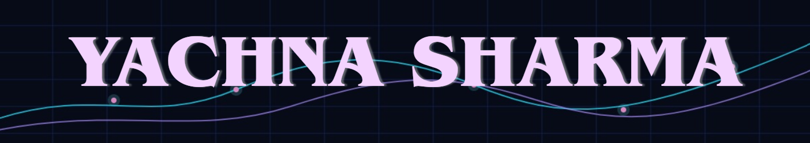

---
### 

<table cellpadding="4">
<tr><td bgcolor="#111827">● ● ● yachna@portfolio:~/system.profile</td></tr>
<tr><td bgcolor="#020617"></td></tr>
</table>

---

### 

<table align="center" cellpadding="4">
<tr><td bgcolor="#111827">● ● ● yachna@portfolio:~/tech.stack</td></tr>
<tr><td bgcolor="#020617"><samp>$ stack --all</samp>  

<samp>LANGUAGES</samp> 
<samp>Python</samp> · <samp>C</samp> · <samp>Java</samp> · <samp>SQL</samp> · <samp>JavaScript</samp>
  <samp>AI / ML</samp> 
<samp>TensorFlow</samp> · <samp>Scikit-learn</samp> · <samp>MediaPipe</samp> · <samp>OpenCV</samp> · <samp>RAG / LLM Applications</samp>
  <samp>BACKEND</samp> 
<samp>FastAPI</samp> · <samp>REST APIs</samp> · <samp>Pytest</samp>
  <samp>DATA</samp> 
<samp>Pandas</samp> · <samp>NumPy</samp> · <samp>Power BI</samp> · <samp>Data Pipelines</samp>
  <samp>TOOLS</samp> 
<samp>Git</samp> · <samp>GitHub</samp> · <samp>VS Code</samp> · <samp>Jupyter</samp> · <samp>Docker</samp>

</td></tr>
</table>

---

### 

### 

